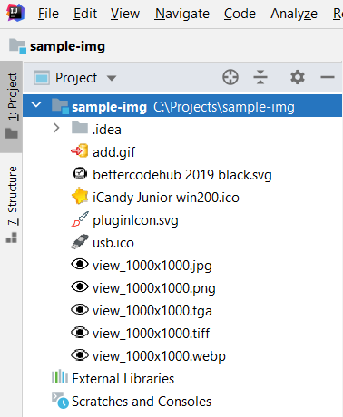

<h1 align="center">
    Icon Viewer 2
</h1>

    <!--a href="https://travis-ci.org/jonathanlermitage/IconViewer"></a-->
    
    
    

Intellij IDEA 2019.3+  (Community and Ultimate) plugin that allows you to preview project images as an icon in your project explorer.  
Helpful if you have a lot of icons in your project, Icon Viewer 2 gives you a nice preview icon. 
  
It works with all JetBrains products like WebStorm, DataGrip, etc.

Download plugin on [GitHub](https://github.com/jonathanlermitage/IconViewer/releases), [JetBrains Plugins Repository](https://plugins.jetbrains.com/plugin/13995-icon-viewer-2) or via IntelliJ IDEA (<kbd>File</kbd>, <kbd>Settings</kbd>, <kbd>Plugins</kbd>, <kbd>Browse repositories...</kbd>, <kbd>Icon Viewer 2</kbd>).

## Author

* Owner of this fork: Jonathan Lermitage (<jonathan.lermitage@gmail.com>, [linkedin](https://www.linkedin.com/in/jonathan-lermitage-092711142/))
* Owner of the original project: [David Sommer](https://github.com/davidsommer/IconViewer).

## Contributors

* n/a

## Build

### Gradle commands

* build plugin: `./gradlew buildPlugin`. See generated jar: `build/libs/ij-extra-icons-x.y.z.193.jar`.
* run IDE with plugin: `./gradlew runIde`.
* check for dependencies updates: `./gradlew dependencyUpdates -Drevision=release -DoutputFormatter=plain -DoutputDir=./build/`.

## Contribution

Open an issue or a pull-request. Contributions should be tested on [master](https://github.com/jonathanlermitage/IconViewer) branch.  
Please reformat new and modified code only: do not reformat the whole project or entire existing file (in other words, try to limit the amount of changes in order to speed up code review).  
To finish, don't hesitate to add your name or nickname to contributors list ;-)

## License

MIT License. In other words, you can do what you want: this project is entirely OpenSource, Free and Gratis.

## Demonstration

Bigger images are scaled to 16x16, supported are:

 - *.gif
 - *.png 
 - *.bmp
 - *.jpg
 - *.jpeg
 - *.bmp
 - *.svg
 - *.wbmp and *.webp (*Android Support* plugin should be activated)
 

